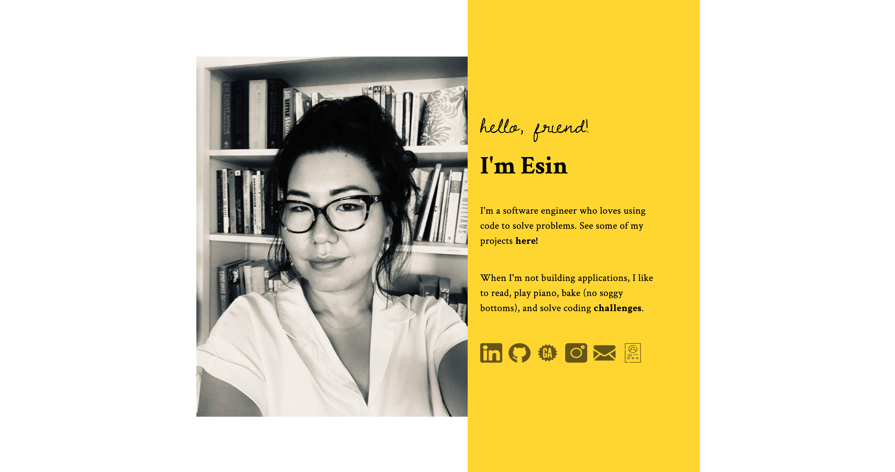
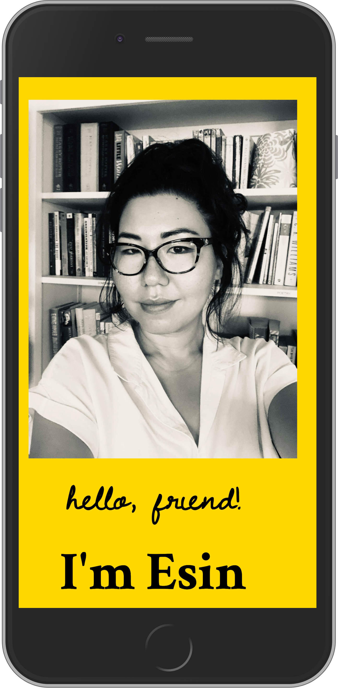

# Portfolio

A simple portfolio page that provides a short bio, links, and projects overview.

## Screenshots

#### Desktop View:

#### Mobile View (iPhone 6/7/8 Plus):

## Technologies Used

This site was built using HTML, CSS and vanilla Javascript.

## Installation Instructions

To run locally, fork and clone this repository to your machine. Open the `index.html` file in a browser window.

## Contribution Guidelines

Please submit an issue with any bugs or feature requests. Feel free to fork and clone if you'd like to explore the code or personalize it to create your own portfolio!
